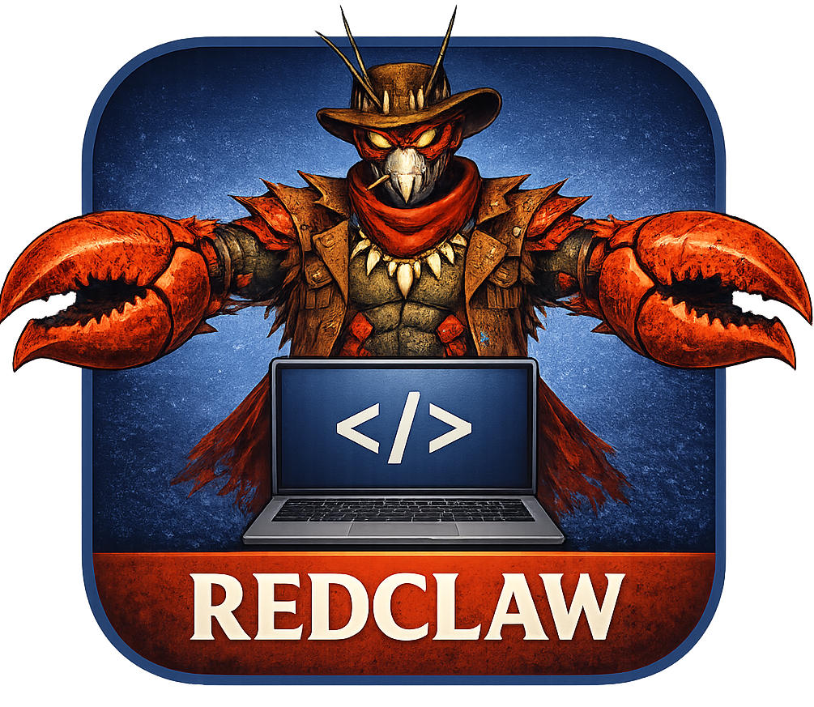

<div align="center">
  
  <h1>RedClaw</h1>
  <p><strong>A minimal, provider-agnostic AI coding agent</strong></p>
</div>

## Interfaces

| Mode | Description |
|---|---|
| **REPL** | Interactive CLI coding agent with streaming, sessions, and compaction |
| **Dashboard** | Web config GUI + process launcher (port 9090) |
| **WebChat** | Browser-based chat with embedded UI (port 8080) |
| **Telegram** | Chat with your agent anywhere, file upload/download, assistant mode |
| **Godot 4.6 GUI** | IDE-like app driving the Python agent via JSON-RPC |

All interfaces share the same LLM client, conversation loop, tools, session persistence, and compaction.

## Features

- **Provider-agnostic** — OpenAI, Anthropic, Ollama, Groq, DeepSeek, OpenRouter, ZAI, or custom endpoints
- **6 core tools** — bash, read_file, write_file, edit_file, glob_search, grep_search
- **Web tools** — web search (SearXNG) and web reader
- **Subagents with bloodlines** — typed workers (coder, searcher, general) with retry-with-reflection and wisdom inheritance
- **Skills system** — agent-manageable YAML+Python plugins
- **MCP client** — connect external tool servers via SSE protocol
- **Persistent memory** — frozen snapshot pattern with security scanning
- **Session persistence** — JSONL conversation history
- **Compaction** — deterministic or LLM-based summarization
- **Permission tiers** — ask, read_only, workspace_write, danger_full_access
- **Hooks** — pre/post tool shell hooks for custom automation
- **Content security** — injection, exfiltration, and invisible unicode scanning
- **Assistant mode** — tasks, notes, reminders, scheduler, briefings with configurable persona name
- **Knowledge graph** — Cognee-backed persistent knowledge (add, cognify, search, memify, prune)
- **Docker support** — multi-stage build with docker-compose
- **Standalone exe** — single-file Windows executable, no Python needed

## Install

### Windows (exe — no Python required)

1. Download `redclaw.exe` from the [latest release](https://github.com/slothitude/RedClaw/releases)
2. Double-click `install.bat` — or copy `redclaw.exe` anywhere on your PATH
3. Run:
   ```
   redclaw
   ```
   You'll see an interactive mode chooser:
   ```
   RedClaw v0.2.0 — Choose a mode:

     1) REPL         Interactive CLI coding agent
     2) Dashboard    Web config GUI + process launcher (port 9090)
     3) WebChat      Browser-based chat (port 8080)
     4) Telegram     Telegram bot

     0) Exit
   ```

To uninstall, run `uninstall.bat` or delete the exe.

### Linux / macOS

```bash
chmod +x install.sh
./install.sh
```

This creates a venv at `~/.redclaw/venv`, installs RedClaw, and symlinks the binary to `~/.local/bin`.

### From source

```bash
git clone https://github.com/slothitude/RedClaw.git
cd RedClaw
pip install -e .              # Install
pip install -e ".[dev]"       # Install with dev deps (pytest, pytest-asyncio)
```

### Docker

```bash
docker compose up
```

Exposes WebChat on port 8080 and Dashboard on port 9090. See `docker-compose.yml` for environment variables.

## Quick Start

```bash
# Launch with interactive mode chooser
redclaw

# Skip the menu — go straight to a mode
redclaw --mode repl
redclaw --mode dashboard
redclaw --mode webchat
redclaw --mode telegram

# Use a specific provider and model
redclaw --provider openai --model gpt-4o
redclaw --provider anthropic --model claude-sonnet-4-20250514
redclaw --provider ollama --model llama3 --base-url http://localhost:11434

# One-shot prompt
redclaw --provider openai "list files in this project"

# Read-only mode (no file writes or bash)
redclaw --permission-mode read_only
```

### CLI Flags

| Flag | Description |
|---|---|
| `--provider` | LLM provider: `openai`, `anthropic`, `ollama`, `groq`, `deepseek`, `openrouter`, `zai` |
| `--model` | Model name (defaults per provider) |
| `--base-url` | Custom API base URL |
| `--permission-mode` | `ask`, `read_only`, `workspace_write`, `danger_full_access` |
| `--session` | Resume a session ID |
| `--working-dir` | Working directory (default: cwd) |
| `--mode` | `repl`, `rpc`, `telegram`, `webchat`, or `dashboard` |
| `--mcp-servers` | MCP server URLs (space-separated) |
| `--tts-url` | TTS server URL |
| `--stt-url` | STT server URL |
| `--search-url` | SearXNG instance URL |
| `--skills-dir` | Custom skills directory |
| `--assistant` | Enable assistant mode (Telegram) with tasks, notes, reminders |
| `--knowledge` | Enable Cognee knowledge graph memory |
| `--knowledge-dir` | Knowledge graph data directory |
| `--knowledge-api-key` | LLM API key for Cognee processing |

### Slash Commands (REPL)

| Command | Description |
|---|---|
| `/help` | Show available commands |
| `/compact` | Compact conversation history |
| `/clear` | Clear session history |
| `/usage` | Show token usage and cost |
| `/model` | Show current model |
| `/session` | Show session info |
| `/quit` | Exit |

### Godot App

1. Open `godot/` in Godot 4.6
2. Configure provider, model, and API key in the sidebar
3. Type messages and hit Send — the Python agent streams responses in real time

## Tools

| Tool | Permission | Description |
|---|---|---|
| `bash` | full access | Execute shell commands with timeout |
| `read_file` | read only | Read file contents (with line range) |
| `write_file` | workspace write | Write content to a file (atomic) |
| `edit_file` | workspace write | Replace exact text in a file |
| `glob_search` | read only | Find files by glob pattern |
| `grep_search` | read only | Search file contents by regex |
| `web_search` | read only | Search the web via SearXNG |
| `web_reader` | read only | Fetch and read web pages |
| `memory` | workspace write | Store, recall, and search persistent memories |
| `subagent` | workspace write | Delegate tasks to isolated sub-agents |
| `task` | workspace write | Manage to-do tasks (add, list, update, delete, search) |
| `note` | workspace write | Manage notes (add, list, view, delete, search) |
| `reminder` | workspace write | Manage reminders with scheduling and due-check |
| `knowledge` | workspace write | Cognee knowledge graph (add, cognify, search, memify, prune) |

## Architecture

```
redclaw/
  api/            Provider-agnostic LLM client, SSE parser, provider registry
  runtime/        Conversation loop, session, compaction, permissions, hooks,
                  subagents (with bloodlines, retry, crypt wisdom), prompt builder
  assistant/      Personal assistant: tasks, notes, reminders, scheduler, briefings
  memory_graph/   Cognee-backed knowledge graph memory
  tools/          Core tools, toolsets, memory, content scanning, assistant tools
  skills/         Skill discovery, loading, agent-managed CRUD, security scanner
  crypt/          Wisdom inheritance: bloodlines, entombment, dharma, metrics
  channels/       Abstract messaging layer (base + Telegram)
  mcp_client.py   MCP SSE client for external tool servers
  cli.py          REPL with rich rendering and interactive mode chooser
  rpc.py          JSON-RPC over stdio (Godot bridge)
  telegram_bot.py Telegram bot interface
  webchat.py      HTTP/WebSocket chat server
  dashboard.py    Flask config GUI and process launcher

servers/          Local MCP servers (TTS, STT, Web Reader)
godot/            Godot 4.6 GUI project
  scripts/        Agent bridge, session manager, settings
  ui/             Chat panel, sidebar, tool panel, status bar
```

## Dependencies

- Python 3.11+
- `httpx>=0.27`, `rich>=13`, `python-telegram-bot>=21.0`, `pyyaml>=6.0`, `aiohttp>=3.9`
- Optional: `edge-tts`, `openai-whisper`, `fastmcp`, `playwright`, `flask` (for local servers/dashboard)
- Any LLM provider
- [Godot 4.6](https://godotengine.org/) (for the GUI app)

## License

MIT
